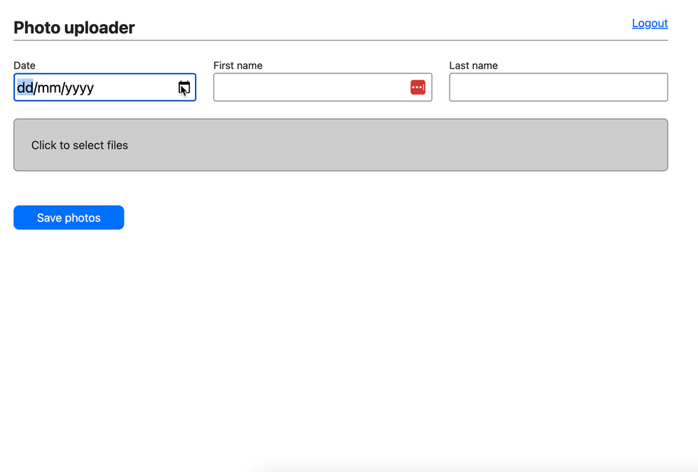

# DropBox Photo Uploader

This application is built using ReactJS and Vite.

It uses a Dropbox application to authenticate to your Dropbox account and simplifies file naming when uploading multiple dated images.



## Live demo

This application is running at:

https://greycastle.github.io/dropbox-photo-uploader/

## Running locally

Running the application is easy using Vite which takes care of bundling and compilation:

```
yarn install
yarn dev
```